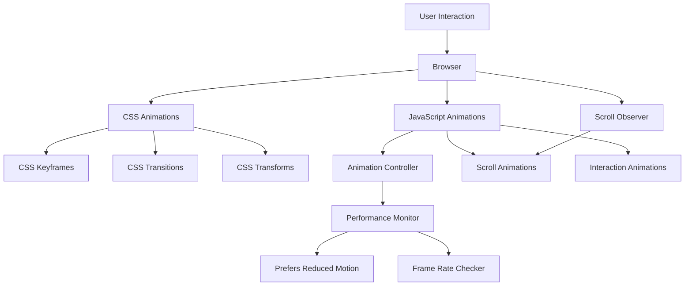

# System Design & Architecture

## Architecture Overview
**What is the high-level system structure?**



**Key components and their responsibilities:**

1. **CSS Animation Layer**: Handles all CSS-based animations (transitions, keyframes, transforms)
2. **JavaScript Animation Controller**: Manages complex animations, scroll triggers, and dynamic effects
3. **IntersectionObserver Manager**: Detects when elements enter viewport for scroll animations
4. **Performance Monitor**: Ensures animations maintain 60fps and respect accessibility preferences
5. **Animation Utilities**: Reusable functions for common animation patterns

**Technology stack choices and rationale:**

- **CSS Animations**: Best performance, hardware-accelerated, no JS overhead
- **JavaScript**: For complex, dynamic animations that require logic
- **IntersectionObserver API**: Efficient scroll detection without performance penalties
- **requestAnimationFrame**: Smooth animation loops
- **CSS Custom Properties**: Easy animation customization and theming
- **No external libraries**: Keep bundle size small, full control over performance

## Data Models
**What data do we need to manage?**

### Animation Configuration Object
```javascript
{
  element: HTMLElement,
  animationType: 'fadeIn' | 'slideUp' | 'scale' | 'rotate' | 'custom',
  delay: number, // milliseconds
  duration: number, // milliseconds
  easing: string, // CSS easing function
  trigger: 'scroll' | 'hover' | 'click' | 'load' | 'custom',
  threshold: number, // 0-1 for scroll trigger
  once: boolean, // animate once or repeat
  reducedMotion: boolean // respect accessibility
}
```

### Animation State Tracking
```javascript
{
  isAnimating: boolean,
  hasAnimated: boolean,
  startTime: number,
  currentFrame: number,
  performance: {
    fps: number,
    frameTime: number
  }
}
```

### Scroll Animation Registry
- Map of elements to their animation configurations
- Tracks which elements have been animated
- Manages cleanup and re-triggering

## API Design
**How do components communicate?**

### Animation Controller API
```javascript
// Initialize animation system
AnimationController.init(options)

// Register element for animation
AnimationController.register(element, config)

// Trigger animation manually
AnimationController.trigger(element, animationType)

// Pause/resume animations
AnimationController.pause()
AnimationController.resume()

// Check performance
AnimationController.getPerformance()
```

### Scroll Animation API
```javascript
// Register scroll-triggered animation
ScrollAnimations.register(element, {
  animation: 'fadeInUp',
  threshold: 0.1,
  once: true
})

// Unregister element
ScrollAnimations.unregister(element)
```

### Utility Functions
```javascript
// Fade in animation
animateFadeIn(element, duration, delay)

// Slide up animation
animateSlideUp(element, duration, delay)

// Scale animation
animateScale(element, from, to, duration)

// Stagger animation for multiple elements
animateStagger(elements, animationType, staggerDelay)
```

## Component Breakdown
**What are the major building blocks?**

### Frontend Components

1. **Hero Section Animations**
   - Staggered text reveal
   - Background particle effects
   - Button hover states
   - Social icon animations

2. **Section Entrance Animations**
   - Fade in from various directions
   - Scale up effects
   - Slide in animations
   - Staggered element reveals

3. **Interactive Element Animations**
   - Button ripple effects
   - Card hover transforms
   - Link underline animations
   - Form input focus states

4. **Scroll Animations**
   - Parallax effects (subtle)
   - Reveal animations
   - Progress bar fills
   - Counter animations

5. **Project Card Animations**
   - 3D hover transforms
   - Image reveal effects
   - Tag animations
   - Link hover states

6. **Skill Section Animations**
   - Progress bar fills on scroll
   - Category card animations
   - Staggered reveals

7. **Contact Form Animations**
   - Input focus/blur effects
   - Submit button states
   - Success/error animations
   - Label animations

### Animation Utilities Module
- `animations.js`: Core animation functions
- `scrollAnimations.js`: Scroll-triggered animations
- `interactionAnimations.js`: User interaction animations
- `performance.js`: Performance monitoring
- `accessibility.js`: Reduced motion handling

## Design Decisions
**Why did we choose this approach?**

### CSS-First Approach
- **Decision**: Use CSS animations for simple effects, JS for complex ones
- **Rationale**: CSS animations are hardware-accelerated and perform better
- **Trade-off**: Less dynamic control, but better performance

### IntersectionObserver for Scroll
- **Decision**: Use IntersectionObserver instead of scroll event listeners
- **Rationale**: More performant, doesn't fire on every scroll event
- **Trade-off**: Slightly more complex setup, but much better performance

### Vanilla JavaScript
- **Decision**: No animation libraries (GSAP, Framer Motion, etc.)
- **Rationale**: Smaller bundle size, full control, no dependencies
- **Trade-off**: More code to write, but better performance and customization

### Performance Monitoring
- **Decision**: Implement FPS monitoring and frame time tracking
- **Rationale**: Ensure animations don't degrade user experience
- **Trade-off**: Small performance overhead, but critical for quality

### Accessibility First
- **Decision**: Always check prefers-reduced-motion
- **Rationale**: Essential for inclusive design
- **Trade-off**: Some animations disabled, but accessible to all users

## Non-Functional Requirements
**How should the system perform?**

### Performance Targets
- **Animation Frame Rate**: 60fps (16.67ms per frame)
- **Animation Start Time**: < 50ms after trigger
- **Memory Usage**: No memory leaks from animation listeners
- **CPU Usage**: < 10% during animations on mid-range devices

### Scalability Considerations
- Animation system should handle 50+ animated elements
- No performance degradation with many simultaneous animations
- Efficient cleanup of unused animations

### Security Requirements
- No XSS vulnerabilities from animation code
- Safe handling of user input in animation triggers
- No external resource loading for animations

### Reliability/Availability Needs
- Animations should gracefully degrade if JavaScript fails
- CSS animations should still work without JS
- No breaking errors if IntersectionObserver unavailable

### Accessibility Requirements
- **WCAG 2.1 AA Compliance**: All animations respect reduced motion
- **Keyboard Navigation**: Animations don't interfere with keyboard users
- **Screen Readers**: Animations don't confuse assistive technologies
- **Focus Management**: Focus states remain visible during animations
